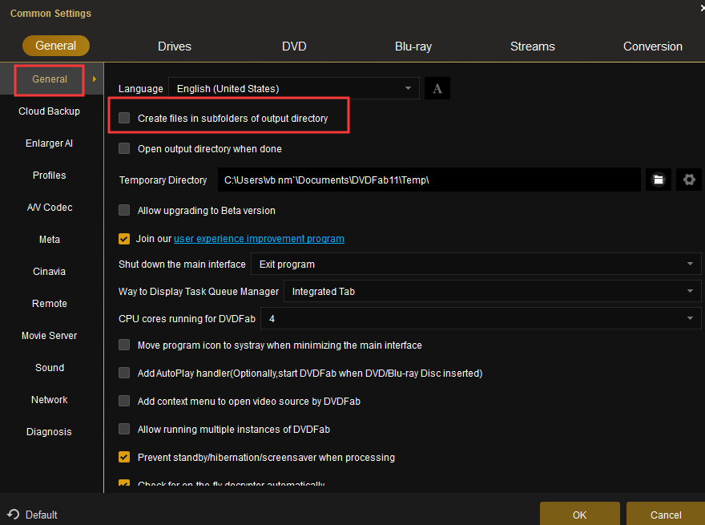

# DVDFabAutoRip
DVDFabAutoRip is a VBScript to Watch for a Disc in the Optical Drive to be reay and Auto Rip (Full ISO Clones) using DVDFab (DVDFab.cn) could be used for other software supporting command line control.

The Idea is that you rip straight to the local folder hosting the SMB File Share for your Zappiti, Infuse Pro etc. Media Players library. You put your optical media in and it Just automaticly rips, no user input needed. When it is done the Optical media will eject automaticly. 

Please Note in DVDFab you need to uncheck the following setting to prevent it from creating subfolders everytime you rip:

I put the script under C:\Scripts\DVDFab.vbs on my NAS Computer (a Mini ITX System with 21TB of Storage using a Perc Raid Card), and have a shortcut to it under the startup folder to auto start at login

I use [Systernals Autologon](https://docs.microsoft.com/en-us/sysinternals/downloads/autologon) to autologon the user at reboot. You can easily do this with the registry, however I like using the utility cause it verify's you typed the name and password correct when enabling

Note: DVDFab Auto Ejects when done copying by default, however if your application is not you can add the below line on Line 28, though it hasn't been tested. 

``objShellApp.Namespace(17).ParseName(objDrive.DriveLetter & ":\").InvokeVerb("Eject")``
