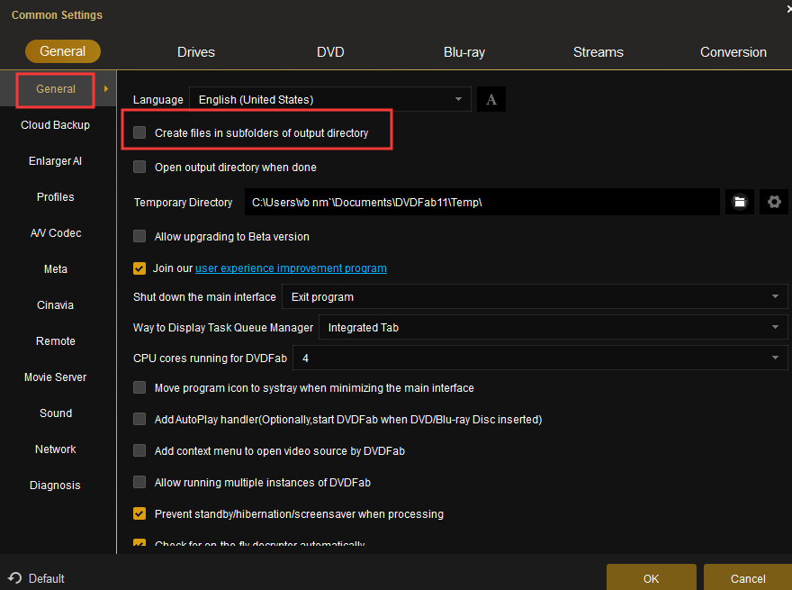

# Depreciated 
Unless you have a speific reason for using the VBScript, you should be using the [PowerShell Script](...). The VBScript will not be maintained going forward. 

# DVDFabAutoRip

# Disclaimer
Note: I do not condone piracy, please use this only for backing up your own physical media you have bought. A lot of work goes into making a movie, make sure they get the support they need by buying your movies legally. 

# Overview
DVDFabAutoRip is a VBScript to watch for a Disc in the Optical Drive to be ready and Auto Rip them (Full ISO Clones) using DVDFab. This script could be used for other software supporting command line control.

The idea is that you rip your movies straight to the local folder hosting the SMB File Share for your Zappiti, Infuse Pro etc. Media Players library. You put your optical media in and it Just automaticly rips, no user input needed. When it is done the Optical media will eject automaticly. 

# Run As a Service

To Run as a service Copy DVDFabAutoRip.ini to C:\ServiceStart\ and run ``srvstart.exe install DVDFabAutoRip -C C:\ServiceStart\DVDFabAutoRip.ini`` after installing [srvstart](https://github.com/rozanski/srvstart). Be sure to set the logon to your administator account, and I'd reccomend using Automatic (delayed Start). Note when running as a service you will not see the interface but you can monitor the status with DVDFab remote app on iOS and android. 

# DVDFab Setting
Please Note: in DVDFab you need to uncheck the following setting to prevent it from creating subfolders everytime you rip:

# Startup Folder Method
I put the script under C:\Scripts\DVDFab.vbs on my NAS Computer (a Mini ITX System with 21TB of Storage using a Perc Raid Card), and have a shortcut to it under the startup folder to auto start at login, I have since switched to running it as a service, Either method will work. 

I would [Systernals Autologon](https://docs.microsoft.com/en-us/sysinternals/downloads/autologon) to autologon the user at reboot. You can easily do this with the registry, however I like using the utility cause it verify's you typed the name and password correct when enabling

Note: DVDFab Auto Ejects when done copying by default, however if your application is not you can add the below line on Line 28, though it hasn't been tested. 

``objShellApp.Namespace(17).ParseName(objDrive.DriveLetter & ":\").InvokeVerb("Eject")``
